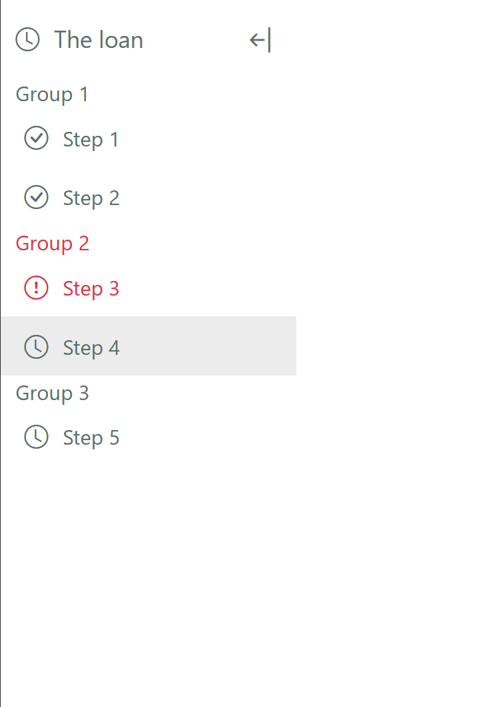
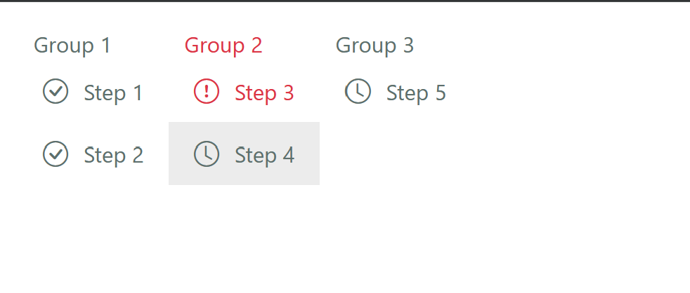

# FormStepPanel Component

The `FormStepPanel` component is a versatile React component designed to act as a step or stage indicator for different sections of an online application form. It supports both vertical and horizontal orientations and provides functionality to mark steps as complete or with errors. The component is highly customizable and can be used in various scenarios.

## Screenshots





## Features

- **Orientation**: Supports both vertical and horizontal orientations.
- **Collapsible Panel**: Can be collapsed or expanded.
- **Active Step**: Highlights the active step.
- **Completion Status**: Marks steps as complete.
- **Error State**: Marks steps with errors.
- **Customizable Icons and COntent**: Each step can have its own icon, content (text or node), and title.
- **Grouped Steps**: Steps can be grouped into categories for better organization.

## Installation

To install the `FormStepPanel` component, you can add it to your project by copying the component files into your project directory. Ensure you have the necessary dependencies installed:

```
npm install react react-bootstrap bootstrap bootstrap-icons
# or
yarn add react react-bootstrap bootstrap bootstrap-icons
```
## Usage

Here's an example of how to use the FormStepPanel component in your application:

```
import React, { useState } from 'react';
import FormStepPanel, { Step } from './components/FormStepPanel';
import 'bootstrap/dist/css/bootstrap.min.css';
import 'bootstrap-icons/font/bootstrap-icons.css';

const steps: Step[] = [
  { id: 'step1', icon: 'bi bi-clock', content: 'Step 1', title: 'Introduction', hasError: false, isComplete: false, group: 'Group 1' },
  { id: 'step2', icon: 'bi bi-clock', content: 'Step 2', title: 'Personal Info', hasError: false, isComplete: false, group: 'Group 1' },
  { id: 'step3', icon: 'bi bi-clock', content: 'Step 3', title: 'Confirmation', hasError: false, isComplete: false, group: 'Group 2' },
  { id: 'step4', icon: 'bi bi-clock', content: 'Step 4', title: 'Review', hasError: false, isComplete: false, group: 'Group 2' },
  { id: 'step5', icon: 'bi bi-clock', content: 'Step 5', title: 'Finalize', hasError: false, isComplete: false, group: 'Group 3' },
  { id: 'step6', icon: 'bi bi-clock', content: 'Step 6', title: 'Submit', hasError: false, isComplete: false, group: 'Group 3' },
  { id: 'step7', icon: 'bi bi-clock', content: 'Step 7', title: 'Approval', hasError: false, isComplete: false, group: 'Group 3' },
  { id: 'step8', icon: 'bi bi-clock', content: 'Step 8', title: 'Complete', hasError: false, isComplete: false, group: 'Group 3' },
  { id: 'step9', icon: 'bi bi-clock', content: 'Step 9', title: 'Summary', hasError: false, isComplete: false, group: 'Group 3' },
];

const App = () => {
  const [activeStepId, setActiveStepId] = useState<string>('step1');
  const [collapsed, setCollapsed] = useState<boolean>(false);

  const handleStepClick = (id: string) => {
    setActiveStepId(id);
  };

  const handleToggleCollapse = () => {
    setCollapsed(!collapsed);
  };

  return (
    <div>
      <FormStepPanel
        steps={steps}
        activeStepId={activeStepId}
        onStepClick={handleStepClick}
        collapsed={collapsed}
        onToggleCollapse={handleToggleCollapse}
        orientation="vertical"
      />
    </div>
  );
};

export default App;
```

### Props

**Step**

Each step object in the steps array should have the following structure:

  - `id` (string): Unique identifier for the step.
  - `icon` (string): Icon class for the step.
  - `content` (ReactNode | string): Content for the step.
  - `title` (string): Title for the step.
  - `hasError` (boolean): Indicates if the step has an error.
  - `isComplete` (boolean): Indicates if the step is complete.
  - `group` (string): Group name for the step.

**FormStepPanel Props**

  - `steps` (Step[]): Array of step objects.
  - `activeStepId` (string | undefined): ID of the currently active step.
  - `onStepClick` (function): Callback function when a step is clicked.
  - `collapsed` (boolean): Indicates if the panel is collapsed.
  - `onToggleCollapse` (function): Callback function to toggle the collapse state.
  - `orientation` ('vertical' | 'horizontal'): Orientation of the step panel.

## Storybook

The FormStepPanel component is also configured to be used with Storybook for interactive development and testing. To start Storybook, run:

```
npm run storybook
# or
yarn storybook
```

**Available Stories**

    Vertical: Displays the step panel in vertical orientation.
    Horizontal: Displays the step panel in horizontal orientation.

**Controls**

    Orientation: Toggle between vertical and horizontal orientations.
    isActive: Select the active step.
    hasError: Toggle error state for steps.
    isComplete: Toggle complete state for steps.
    collapsed: Toggle the collapsed state of the panel.


## Contributions

For any contributions, please feel free to open an pull request on the project's repository.
